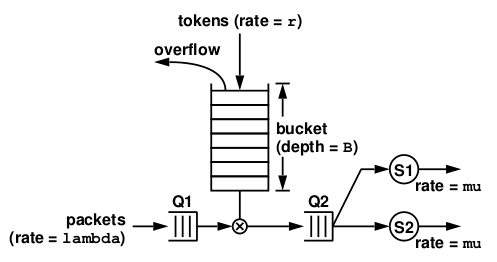

# Traffic Controller Simulation

## Summary

This program emulate/simulate a traffic shaper (token bucket filter) who transmits packets controlled by a token bucket filter depicted
below using POSIX pthread multi-threading within a single process.

## System Architecture



**Figure 1:** A system with a token bucket filter.

Figure 1. depicts the high-level of a architecture of this token bucket filter system. The token bucket has a capacity (bucket depth) of `B` tokens. Tokens arrive into the token bucket according to an unusual arrival process where the inter-arrival time between two consecutive tokens is `1/r`. `r` is called the token arrival rate. Extra tokens (overflow) would simply disappear if the token bucket is full. A token bucket, together with its control mechanism, is referred to as a token bucket filter.

Packets arrive at the token bucket filter according to an unusual arrival process where the inter-arrival time between two consecutive packets is `1/lambda`. We will call `lambda` the packet arrival rate. Each packet requires P tokens in order for it to be eligible for transmission. (Packets that are eligible for transmission are queued at the Q2 facility.) When a packet arrives, if Q1 is not empty, it will just get queued onto the Q1 facility. Otherwise, it will check if the token bucket has P or more tokens in it. If the token bucket has P or more tokens in it, P tokens will be removed from the token bucket and the packet will join the Q2 facility, and wake up the servers in case they are sleeping. If the token bucket does not have enough tokens, the packet gets queued into the Q1 facility. Finally, if the number of tokens required by a packet is larger than the bucket depth, the packet must be dropped (otherwise, it will block all other packets that follow it).

The transmission facility (denoted as S1 and S2 in the above figure and they are referred to as the "servers") serves packets in Q2 in the first-come-first-served order and at a service rate of `mu` per second. When a server becomes available, it will dequeue the first packet from Q2 and start transmitting the packet. When a packet has received `1/mu` seconds of service, it leaves the system. Also, the servers are kept as busy as possible.

The system can run in only one of two modes:
* **Deterministic:** In this mode, all inter-arrival times are equal to `1/lambda` seconds, all packets require exactly `P` tokens, and all service times are equal to `1/mu` seconds (all rounded to the nearest millisecond).

* **Trace-driven:** In this mode, we will drive the simulation using a trace specification file. Each line in the trace file specifies the inter-arrival time of a packet, the number of tokens it needs in order for it to be eligible
for transmission, and its service time.

The system simulates the packet and token arrivals, the operation of the token bucket filter, the first-come-first-served queues Q1 and Q2, and servers S1 and S2. It also produces and sent to the output a trace of the simulation for every important event occurred in the simulation. 

## Implementation

This program utilizes the POSIX multi-threading standard to implement multithreading. It uses two thread for packet arrival (one for each mode), one thread for token arrival, and one thread for each server. In addition, it uses one mutex to protect Q1, Q2, and the token bucket. 

The Q1 and Q2 queues must have an infinite capacity and a list data structure is used to implement them.

If the user presses `<Ctrl+C>` on the keyboard, the program terminates gracefully. It terminates the arrival thread and the token depositing thread, removes all packets in Q1 and Q2, let your server finish transmitting the current packet, and output statistics.

## Compile
```shell
$ make traffic_controller
```
Note: A 32-bit Ubuntu 16.04 system was used to compile/run

## Commandline Usage
```shell
$ ./traffic_controller [-lambda lambda] [-mu mu] [-r r] [-B B] [-P P] [-n num] [-t tsfile]
```

## Run
Deterministic mode using default lambda, mu, r, B, P, and n
```shell
$ ./traffic_controller
```

Deterministic mode using custom parameters
```shell
$ ./traffic_controller -lambda 2 -mu 0.5 -r 2 -B 15 -P 4 -n 30
```

Trace mode mode
```shell
$ ./traffic_controller -t tsfile
```

## Output Syntax
If a packet is served by a server, there must be exactly 7 below output lines that correspond to this packet:

* p1 arrives, needs 3 tokens, inter-arrival time = 503.112ms
* p1 enters Q1
* p1 leaves Q1, time in Q1 = 247.810ms, token bucket now has 0 token
* p1 enters Q2
* p1 leaves Q2, time in Q2 = 0.216ms
* p1 begins service at S1, requesting 2850ms of service
* p1 departs from S1, service time = 2859.911ms, time in system = 3109.731ms

## Output Example

```shell
$ ./traffic_controller 
Emulation Parameters:
number to arrive = 20
lambda = 1
mu = 0.35
r = 1.5
B = 10
P = 3
00000000.000ms: emulation begins
00000668.593ms: token 1 arrives, token bucket now has 1 token
00001002.902ms: p1 arrives, needs 3 tokens, inter-arrival time = 1002.902ms
00001002.948ms: p1 enters Q1
00001334.207ms: token 2 arrives, token bucket now has 2 tokens
00001999.271ms: token 3 arrives, token bucket now has 3 tokens
00001999.392ms: p1 leaves Q1, time in Q1 = 996.444ms, token bucket now has 0 tokens
00001999.406ms: p1 enters Q2
00001999.449ms: p1 leaves Q2, time in Q2 = 0.043ms
00001999.454ms: p1 begins service at s1, requesting 2857.143ms of service
00002003.142ms: p2 arrives, needs 3 tokens, inter-arrival time = 1000.240ms
00002003.182ms: p2 enters Q1
00002666.135ms: token 4 arrives, token bucket now has 1 token
00003001.260ms: p3 arrives, needs 3 tokens, inter-arrival time = 998.118ms
00003001.291ms: p3 enters Q1
00003335.235ms: token 5 arrives, token bucket now has 2 tokens
00004002.074ms: token 6 arrives, token bucket now has 3 tokens
00004002.130ms: p2 leaves Q1, time in Q1 = 1998.948ms, token bucket now has 0 tokens
00004002.139ms: p2 enters Q2
00004002.100ms: p4 arrives, needs 3 tokens, inter-arrival time = 1000.840ms
00004002.196ms: p4 enters Q1
00004002.294ms: p2 leaves Q2, time in Q2 = 0.155ms
00004002.343ms: p2 begins service at s2, requesting 2857.143ms of service
00004665.726ms: token 7 arrives, token bucket now has 1 token
^C
00004858.740ms: p1 departs from s1, service time = 2859.286ms, time in system = 3855.792ms
00006863.624ms: p2 departs from s2, service time = 2861.281ms, time in system = 4860.442ms
00006863.735ms: p3 removed from Q1
00006863.756ms: p4 removed from Q1
00006863.762ms: emulation ends

Statistics:

     average packet inter-arrival time = 0.200105
     average packet service time = 2.86028

     average number of packets in Q1 = 0.436407
     average number of packets in Q2 = 2.88655e-05
     average number of packets at S1 = 0.416577
     average number of packets at S2 = 0.416868

     average time a packet spent in system = 4.35812
     standard deviation for time spent in system = 0.502325

     token drop probability = 0
     packet drop probability = 0
```


